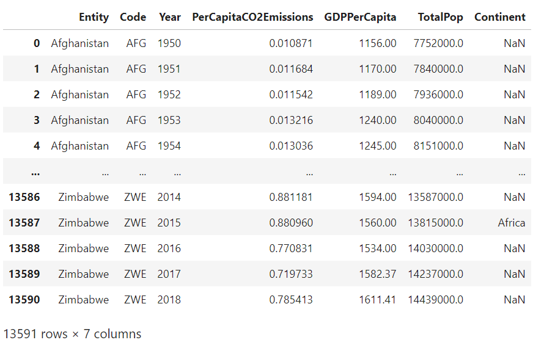

# GDP vs. CO2 Emissions - Regression 
# Abstract
This project seeks to investigate the correlation in countries' GDPs with their annual greenhouse gas emissions. This can be used to evaluate the economic implications of using fossil-fuels vs. renewable energy, and to assess how feasible it would be for developing countries to adopt net-zero emission policies while upholding their economic growth objectives.
# Conclusion 
## Modeling

After data cleaning, exploratory data analysis and feature engineering a linear regression model was trained with the following results:

- $R^2: 0.545$
- $F \space Statistic : 4072, p(F \space statistic) : 0.00$

with the form:

$$
{ln(CO_2)}=-1.4979​​+ 0.2014*​​GDPpercapita-0.0013*​​GDPpercapita^2+0.7854*developed-0.0014*GDPpercapita \times developed
$$

This finalized linear regression model was found after testing various variations of the features and functional transformations on the explanatory and response variable. 

## Analysis
In general, it was found that developing nations are more likely to follow a linear relationship between GDP and CO2 emissions per capita, while developed nations are more likely to follow a quadratic relationship between GDP and CO2 emissions per capita.  

This correlation suggests that developing countries may require fossil-fuel industrialization to grow their economies, while developed countries have the economic stability to transition into other forms of energy generation, such as variable renewable energy (VRE) generation. 

The models built in this project could be useful when evaluating proposed policies such as net-zero emissions and carbon taxes for various nations, since the models could suggest how feasible it would be for developing countries to adopt such policies while maintaining GDP per capita at their target levels over the long run. These models could be used not only to evaluate, but to create new policies that would counter-act global warming and climate change while keeping into account the nations' economic interests.

## Data
### Data Overview
The data used for this project came from Our World in Data, and the source is from the Global Carbon Project; Maddison Project Database (Bolt and van Zanden):
>https://ourworldindata.org/grapher/co2-emissions-vs-gdp

The data has the following features:
| Feature| Description
| ----------- | ----------- | 
| Entity| Name of country or region| 
| Code| Abbreviated name for country or region| 
| Per capita CO2 emissions| Amount of CO2 emissions per capita in a country in a given year|
| GDP per capita| GDP per capita in a country in a given year|
| Total population (Gapminder, HYDE & UN)| The total population of a country or region in a given year|
| Continent| The continent the country is in |
The initial dataframe contained 53,094 rows and 8 columns. 

### Data Cleaning
- Some observations had NaN values for GDP per capita and CO2 emissions per capita, so those observations were removed
- The annotations column didn't provide any relevant information to this study, so the field was removed
- Some fields' names contained spaces, so for ease of access later some columns were edited to remove spaces and shorten names
```

```
## Interactive Visualization of the Data on Tableau
For an interactive look at different nations' GDP per capita vs. CO2 emissions, you can take a look at my [interactive dashboard](https://public.tableau.com/app/profile/tomas.angelini/viz/GDPvsCO2EmissionsbyCountry/CountryGDPvs_CO2EmissionsDashboard) on Tableau public. 

## Exploratory Data Analysis
### Statistical Summary
Lets take a look at a statistical summary of our data:
```

```
The first thing I noticed when observing this summary was in the minimum value for Per Capita CO2 emissions, with a value of -2.67. Per Capita CO2 emissions having a negative value is illogical, since the value is derived from
$$
GDP per capita=CO_2Emissions/ Population
$$
where neither total CO2 emissions nor population can be negative. Taking a look into the dataframe for the negative values, I found there were only 7 instances with these values, many of them being very close to 0. I removed these outliers due to being outside of the logical range of values.

Taking a look at the statistical summary of our dataset now we have
```

```
### Distributions
An interesting observation to make in regards to per capita GDP and CO2 emissions is that both features have much lower quartile values than the max value (e.g. PerCapitaCO2Emissions 75% quartile is 5.09, while its max value is 101.02), suggesting a right-skew distribution of the data for these features. Lets take a look at the histograms of these two features:
```

```
```

```
We can see a clear right-skew distribution for our two main features, which we'll need to keep in mind when we get to feature engineering and model building.

### Linear Correlations
Lets take a look at correlations between Per Capita CO2 emissions, GDP per capita, and total population:
```

```
```

```
There seems to be a strong correlation of $0.67$ between GDP per capita and CO2 emissions per capita, which means we might want to dive deeper into that correlation to inform how we build our predictive models later. Lets take a look at a scatter plot between these two features to visualize the correlation:
```

```
We can see that in general, as GDP per capita increases so do CO2 emissions per capita. The $0.67$ correlation coefficient suggests a linear association, but the scatter plot is quite populated and could also suggest a slightly quadratic or logarithmic association between the two features. Lets take a look at the same scatter plot, this time faceted by continent:
```

```

### Developed vs. Developing Countries
Lets take a look at the GDP per capita vs. CO2 emissions per capita plots of a few countries to see if we find any interesting relationships between these plots and the countries' "developed" statuses. We'll take a look at three developed and three developing countries, with their "developed" status being sourced from the *World Economic Situation and Prospects*' [country classification document](https://www.un.org/en/development/desa/policy/wesp/wesp_current/2014wesp_country_classification.pdf):

**Developed Countries**
```

```

**Developing Countries**
```

```
At a glance, there seems to be an interesting distinction between developed vs. developing countries when it comes to the correlation of GDP to CO2 emissions:  

-   Developed countries seem to follow a parabolic curve that peaks after a certain threshold of GDP per capita, and then begins to decline.  
-   Developing countries seem to follow a more linear association as GDP increases.  

Based on this observation, I'll segment the dataset into "developing" and "developed" countries to see if this pattern can be seen across the entire dataset. 
> I've used the WESP country classification document linked above to create these classifications, and for simplicity I've grouped together "economies in transition" with "developing economies" to make the "developed" feature a binary categorical variable.

Taking a look at a scatter plot once again, but with the distinction of countries being developed or developing, we have the following visualization:
```

```
It becomes clearer here that in general, developed economies seem to have a decline in per capita CO2 emissions after reaching a certain GDP per capita, while developing economies don't seem to follow that same pattern. Lets take a simple regression on these two categories to compare the slopes:
```

```

Taking a look at the regression lines above, there's already a pronounced difference in slope when comparing developed to developing countries in their relationships.  Let's take a look at the correlations again between GDP per capita and Per Capita CO2 emissions between developed and developing countries:
```

```
```

```
Comparing the above correlation tables, we see that developed countries have a correlation between per capita CO2 emissions and GDP per capita of $0.627$, while developing countries see a correlation of $0.693$. This suggests a linear model might be more appropriate for developing countries, while a quadratic model might be better fit for developed countries. Let's fit a 2nd-order curve to each of the developed countries' data:
```

```
The graph above clearly shows that in general, a developed country's per capita CO2 emission will read a peak and begin to decrease as GDP per capita increases. If we fit a quadratic curve to all of the data points of developed countries and compare it with that of developing countries, we can see developed countries follow a quadratic curve closer than developing countries:
```

```
```

```

## Feature Engineering
Now that we've taken a look at distributions of the data, linear correlations between features, and found insights in developed vs. developing economies, lets perform some feature engineering to create a robust model out of the data.

**GDP Per Capita**
Since we've seen in our EDA section that CO2 emissions per capita seem to follow a quadratic curve (specifically with developed economies) with respect to GDP per capita, I've created a new feature for *GDP per capita squared*, so that the regression model can be fit with this quadratic relationship included. Because GDP per capita data is also heavily right-skewed, I'll take the natural logarithm of the GDP per capita values so that the residuals of the final model follow a normal distribution more closely.

**Per Capita CO2 Emissions**
Since the Per Capita CO2 Emissions data is right-skewed, I'll take the natural logarithm of the feature to create *Log CO2 Emissions* as the dependent feature to fit the regression model to. 

**Interaction Term**
Because a country being developed or not affects the relationship between GDP per capita and CO2 emissions per capita, I'll create an interaction term between *GDP per capita squared* and *developed*.

**Scaling Terms**
Since the values of GDP per capita are much greater than the values of $ln$(CO2 emissions per capita), I'll divide the features including GDP per capita by 1000 to scale the features down into a measure by thousands. This way, the regression coefficients will be greater and easier to understand.

Now that we have our explanatory variables ready for our regression models, we can begin testing models and evaluating their results to decide which model performs best on our dataset.

## Model Building
Now that we have the features ready for our model, we can train a regression model using Ordinary Least Squares (OLS) and analyze the resulting regression.

### The Math Behind Regression
**General Form**
In its general form, a regression model can be expressed as
$$
\hat{f​(x)}=\hat{B_0​​}+∑\hat{B_j​}​x_j​
$$

where $\hat{B}_0$ is the intercept, $\hat{B}_j$ are the parameters, $x_j$ are the explanatory variables, and $\hat{f}(x)$ is the dependent variable.

**Least Squares Estimation**
In order to generate a regression line through the data, we must define a cost-function that we can minimize as much as possible. This cost-function is called the [Least squares estimation,](https://towardsdatascience.com/explain-linear-regression-with-manual-calculation-1622affdce6b) and it attempts to calculate the $\hat{B}$ parameters such that sum of squared errors is minimized.

$$
SSE = \sum_{i=1}^N(y_i - f(x_i))^2 = \sum_{i=1}^N(y_i - \hat{B_0} - \sum_{j=1}^p\hat{B_j}x_{ij})^2
$$
This equation calculates, for every data pair (x,y) denoted as i, the difference between the actual $y_i$ value and the estimated $\hat{y}_i$ value, and squares the difference to avoid any negative values. If there were negative values, some errors would cancel out others, and thus the end sum would not be representative of how truly "off" the predictions were from the true values.

> The difference $y_i - \hat{y}_i$ is called a residual.

### Regression Model
With the features we've prepared for this regression, our regression takes the form of 
$$
{ln(CO_2)}=B_0​​+B_1​​GDPpercapita+B_2​​GDPpercapita^2+B_3​developed+B_4​​GDPpercapita \times developed
$$
### Regression Results
Fitting this regression equation provides the following OLS Regression Results:
```

```
Lets take a look at some of the values on this table to evaluate our regression:

**Regression Metrics**
- $R^2: 0.545$
	- This value means that the model can explain 54.5% of the total variation in Y by the variation in our X features.
- $F \space Statistic : 4072, p(F \space statistic) : 0.00$
	- The F-Statistic with a p-value of 0.00 allows us to reject the null hypothesis that the group of X features are not statistically significant in correlation to the Y prediction of ln(CO2).
- $Skew: -0.781$
	- The skew value tells us how the residuals of the regression are skewed across the dataset, and this value seems to be low enough to suggest the regression model only has some skew.

**Regression Coefficients**
Plugging the regression coefficients into our regression model provide the following equation:
$$
{ln(CO_2)}=-1.4979​​+ 0.2014*​​GDPpercapita-0.0013*​​GDPpercapita^2+0.7854*developed-0.0014*GDPpercapita \times developed
$$
Lets break down the coefficients and how to interpret them in our model:

- $GDPPerCapita(thousands) \space coef = 0.2014$
	- A $1000 increase in GDP per capita is associated with a 20.14% increase in CO2 emissions per capita.
- $GDPPerCapitaSquared(thousands) \space coef = -0.0013$
	- A $1000 increase in GDP per capita squared is associated with a 0.13% decrease in CO2 emissions per capita.
- $developed \space coef = 0.7854$
	- A developed country is associated with a 78.54% increase in CO2 emissions per capita than a developing country.
- $developedInteractionGdpPerCapita \space coef = -0.0014$
	- A developed country with a $1000 increase in GDP per capita is associated with a 0.14% decrease in CO2 emissions per capita

All regression coefficients have a p-value < 0.05, which implies we can reject the null hypothesis that any of the coefficients $\beta$ in the regression =  0. This means all explanatory variables used in this regression are statistically significant in our model.

For further confirmation that our coefficients are statistically significant, we can take a look at the 2.5% and 97.5% confidence intervals to see that none of our coefficients include $\beta=0$ within the confidence intervals, meaning we have rejected the null hypothesis that $\beta=0$  for all $\beta$.


 

### Analyzing the Residuals
To further analyze potential skews in our regression model, we'll take a look at the Q-Q Plot and Residual Plot.

**Q-Q Plot**
```

```
The shape of our normal Q-Q plot contains what are called ["heavy tails"](https://data.library.virginia.edu/understanding-q-q-plots/) , which imply that the data may have more extreme values than is expected from a normal distribution. This aligns with the exploratory data analysis done on the dataset, which showed that many of the features present exhibited a heavy right-skew distribution.  The fact that our model's Q-Q plot has heavy tials implies that a non-linear model could potentially work better in fitting the distribution of the data. 

**Residual Plot**
```

```
The residual plot doesn't seem to reveal any clear pattern or trend across the residuals in our model, which is a good sign: residual plots with clear patterns, outliers, or high standard errors imply that a linear model is not generalizing well to the data and that a higher-order model may be necessary. This residual plot confirms that while there are some heavy tails in the residuals visualized by the Q-Q plot, in general the linear model seems to be generalizing well to the data. 

## Reflections and Suggestions for Future Work
Overall, this regression project led to a lot of personal discoveries and learning when it came to exploring unfamiliar data sets, optimizing and feature engineering to best prepare the data for modeling, and utilizing various regression metrics and plots to gather insights on the statistical use of the built model. 

Attempting to fit a linear regression model to make predictions of a country's CO2 emissions per capita based on only one given explanatory variable and three engineered features provided me with great appreciation of how complex and difficult it is to model inherently human-driven actions. The fact that a multi-faceted behaviour such as a nation's CO2 emissions per capita could even be modeled to some degree of accuracy using the linear model described above is fascinating to me, but I know that the limitations of few explanatory variables and a linear fit must still fall short of more robust statistical methods. 

In the future, I would take a look at a few things to expand this project:
- Gather more domain knowledge on CO2 emissions and GDP growth to find possible explanatory variables that could have led to omitted variable bias in this linear model
- Look into new methods other than taking the logarithm of a feature to ensure the normality assumption of a linear regression
-  Test other models that can fit the data with more degrees of freedom or robustness to create a more accurate model    

All the code and data associated with this project can be found on my [Github](https://github.com/TommyAngelini/Data-Science-Projects/tree/main/Projects/GDPVersusEmissions).


> Tomas Angelini, 2021                                                                                                             
